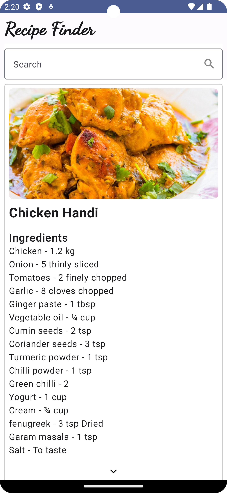

# Recipe Finder App using MVI

Welcome to the Recipe Finder App repository! This repository contains the source code and resources for the Recipe Finder App developed using the Model-View-Intent (MVI) architecture on the Android platform using Kotlin.

## Overview

The Recipe Finder App is a demonstration of how to build a modern Android app using the MVI architectural pattern. It showcases best practices for app architecture, user interface design, and interaction. Users can search for recipes, view details, and more.

## Features

- Get a random recipe from the api
- Search for recipes using keywords
- Search for recipe using first letter
- View detailed recipe information
- Clean and modular architecture using MVI
- Kotlin programming language

## Api
 - https://themealdb.com/

## Screenshots By Main Coder (YoursSohail) 

  

## Screenshots from my changed code. 
### Screenshot from random recipe api

### Screenshots from search by name api.

### Screenshots from search by letter api.

## Video Walkthrough

Check out the video walkthrough of the Recipe Finder App on YouTube: [Watch Video](https://youtu.be/xZ_A6kYfMEg)

## Getting Started

To run the Recipe Finder App on your local machine, follow these steps:

1. Clone this repository from main coder: `git clone https://github.com/YoursSohail/RecipeFinderApp-MVI.git`
2. Clone this repository from my code: `git clone https://github.com/skp3214/RecipeFinderApp.git`
3. Open the project in Android Studio.
4. Build and run the app on an emulator or a physical device.

## Contributing

Contributions are welcome! If you find any issues or want to enhance the app, feel free to submit a pull request. Make sure to follow the coding guidelines and add appropriate tests.

Happy coding!
